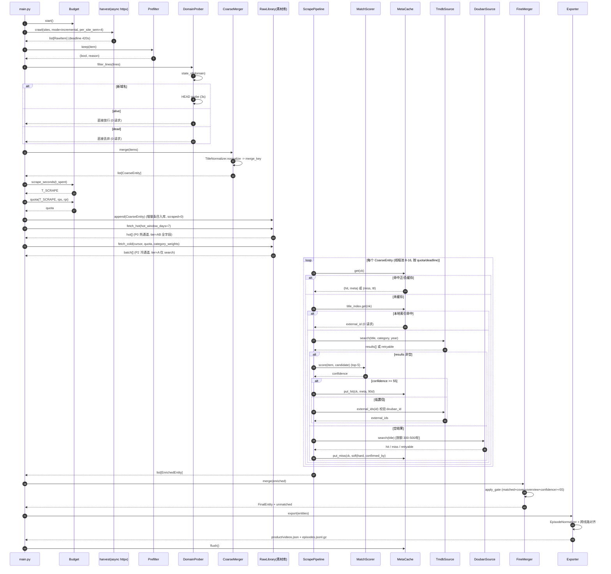

# SuenMedia 链路重构设计文档

> 版本：**v1.1** ｜ 作者：高见远（架构师） ｜ 基线：`2026-09-08` 实测数据
> 目标流程：**采集 → 探活 → 粗犷合并 → 刮削 → 精细合并 → 产物**
> 设计原则：宁选简单可落地，不选过度工程；不做历史兼容迁移。

---

## 修订记录

| 版本 | 日期 | 变更 |
|---|---|---|
| v1.0 | 2026-09-08 | 初版：目标架构、六阶段设计、归一化/集名/打分规则、预算算法、缓存与产物契约、任务分解 |
| **v1.1** | 2026-09-08 | **采集与刮削彻底解耦**（用户方案定稿）<br>① 新增 **阶段 0：一次性全量采集建素材库**（只 抓→探活→粗合并，**不刮削**），日常轮次只抓 24h 增量；<br>② 刮削对象由「本轮采集到的条目」改为「**从全量素材库按预算取未刮削条目**」，新增游标机制；<br>③ **旧数据全丢**：现有 `json/raw/*`、`enriched.jsonl.gz`、5MB `metadata_cache.json` 一律不复用，素材库由阶段 0 重新生成；<br>④ 明确 **热通道直拉 detail 全字段 / 冷通道 Tier A 延后补全** 的分层；<br>⑤ 任务列表新增 **T00 全量采集**；Q3 收敛预期重算为 Tier A 约 14 轮 |

---

## 0. 基线事实（直接引用，不再复验）

| 项 | 数值 | 来源 |
|---|---|---|
| 原始采集条目 | 299,961（10 站） | `json/raw/*.jsonl.gz` |
| 过滤 + 跨站去重后 | **65,386**（21.8%） | 实测 |
| 分类构成 | tv 33,305 / movies 20,552 / anime 8,743 / variety 2,786 | 实测 |
| 线路总数 / CDN 域名数 | 449,935 / **147**（Top3 各占 13.3%） | 实测 |
| 日均新增 IP | 196；日均更新 593（其中 ~400 为老项目加集，不需刮削） | 实测 |
| 匹配率 | tv 95% / movies 85% / anime 84% / variety 67% | 实测 |
| 评分覆盖 | tv 56% / movies 52% / anime 46% / variety 28% | 实测 |
| 综艺集名噪声 | 日期期号占 **22.62%**；`第一集/2集/03集` 仅占 1.1% | 实测 |
| 各站进度 | `page:1502 / done:false`，采集未跑完，真实总量动态增长 | 实测 |
| TMDB 限速 | 官方 **40 请求 / 10 秒 = 4 req/s** | 已拍板 |
| 每轮时间预算 | **30 分钟** | 已拍板 |

### 必须修的 Bug（已定位复现，全部纳入任务清单）

| # | Bug | 位置 | 修复方向 |
|---|---|---|---|
| B1 | **管道死锁** | `main.py:139-153` `_enrich_once(pool, item)` 向同一 `ThreadPoolExecutor` submit 内层任务后立即 `fut.result()` 阻塞。当 `len(items) > pipeline_workers(20)` 时，外层任务占满全部线程并互等排队中的内层任务 → 死锁（实测 items=40/workers=20 只完成 3 个） | 删除 `_inflight` 嵌套机制；改为**提交前按归一化 key 分组去重**（即粗犷合并前置） |
| B2 | **豆瓣熔断阈值过敏** | `metadata_scraper.py:86-87` `_douban_fail >= 5`。"海外不可用"是错误假设（实测海外出口 8/8 全部 200） | 改为**失败率熔断 + 半开重试**；豆瓣升为正式兜底源，每轮限额 300-500 次 |
| B3 | **匹配无校验** | `metadata_scraper.py:188` `best = results[0]` 直接取第一条，错配率 3-8% | 多信号置信度打分（§6） |
| B4 | **采集串行** | `crawl_maccms.py:133` `iter_maccms_pages` 逐页生成，单页 `timeout=12s` × 4 次重试、退避最长 60s | httpx 异步 + 每站 semaphore |
| B5 | **命名双轨** | 中间产物 `poster` / 最终产物 `cover`（`aggregator.py:470` 有映射） | 全链路统一为 `cover` |

---

## 1. 目标架构与模块划分

### 1.1 分层

```
┌──────────────────────────────────────────────────────────────┐
│ 入口层    main.py  （唯一 CLI 入口 + 预算调度 + 阶段编排）        │
├──────────────────────────────────────────────────────────────┤
│ 管道层    pipeline/  prefilter → probe → coarse_merge →        │
│                      scrape → fine_merge → export             │
├──────────────────────────────────────────────────────────────┤
│ 适配层    sources/   tmdb · douban · tvdb · bilibili · omdb     │
│           crawlers/  maccms · harvest                          │
├──────────────────────────────────────────────────────────────┤
│ 领域层    normalize/ title · episode · category                 │
│           taxonomy.py · schema.py                              │
├──────────────────────────────────────────────────────────────┤
│ 基础设施  core/  config · cache · ratelimit · http · logging     │
└──────────────────────────────────────────────────────────────┘
```

**并发模型（已拍板）**

| 阶段 | 模型 | 参数 | 理由 |
|---|---|---|---|
| 采集 | **httpx AsyncClient** | 10 站并发 × 每站 `semaphore(4)` 页 | 单页 12s 超时 × 1500 页，串行不可接受 |
| 探活 | 同步池（少量请求） | 8 并发 | 域名级后每轮仅个位数新域名 |
| 刮削 | **线程池 requests** | **8-16 并发**（受 4 req/s 限制） | 4 req/s 下 8-16 并发已跑满限速，async 无收益 |
| 合并/导出 | 单线程 | — | 纯 CPU + 文件 I/O |

### 1.2 文件清单（`D:\工作目录\软件\suenmedia\`）

| 路径 | 动作 | 内容 / 来源 |
|---|---|---|
| **`core/`** | | |
| `core/__init__.py` | 新 | — |
| `core/config.py` | 新 | 类型化 `Settings` / `Config`；迁自 `common.load_settings` / `load_config` |
| `core/cache.py` | 新 | SQLite(WAL)：`MetaCache`(正+负缓存) / `TitleIndex` / `DomainRegistry` / `RawSeen` / **`RawLibrary`+刮削游标**（§7.2） |
| `core/ratelimit.py` | 新 | `TokenBucket` + per-source 限速 + 全局 429 熔断 |
| `core/http.py` | 新 | httpx sync/async 客户端工厂 + 退避重试；迁自 `common.get_session` |
| `core/logging.py` | 新 | 阶段计时 + 结构化事件；迁自 `progress_log.py` |
| **`normalize/`** | | |
| `normalize/__init__.py` | 新 | — |
| `normalize/title.py` | 新 | 标题归一化 + 季/部序号提取（**重构 `title_cleaner.py`**） |
| `normalize/episode.py` | 新 | 集名规范化 + air_date 解析 + 跨线路对齐 |
| `normalize/category.py` | 新 | `categorize_type`；迁自 `common.py` |
| `normalize/tests_normalize.py` | 新 | 归一化用例集（纯函数自测，`python -m normalize.tests_normalize`） |
| **`crawlers/`** | | |
| `crawlers/maccms.py` | 新 | 迁移 `crawl_maccms.py`，改 httpx async |
| `crawlers/harvest.py` | 新 | 迁移 `harvest.py`，async 编排 + 每站 semaphore |
| `crawlers/custom_demo.py` | 保留 | — |
| **`sources/`**（拆自 `metadata_scraper.py` 1074 行） | | |
| `sources/__init__.py` | 新 | — |
| `sources/base.py` | 新 | `SourceAdapter` 协议 + 三态 `hit/miss/retryable/skipped` |
| `sources/tmdb.py` | 新 | search + detail（**不拉分季详情**，省 ~55% 请求） |
| `sources/douban.py` | 新 | 正式兜底源；失败率熔断 + 半开重试；每轮限额 |
| `sources/tvdb.py` | 新 | TheTVDB |
| `sources/bilibili.py` | 新 | wbi 签名 + 番剧搜索 |
| `sources/omdb.py` | 新 | IMDb 评分兜底（需 key） |
| `sources/scorer.py` | 新 | 置信度打分模型（§6） |
| **`pipeline/`** | | |
| `pipeline/__init__.py` | 新 | — |
| `pipeline/prefilter.py` | 新 | L1-L5 前置过滤 |
| `pipeline/probe.py` | 新 | **域名级**探活（重构 `m3u8_checker.py`） |
| `pipeline/coarse_merge.py` | 新 | 粗犷合并（归一化标题精确匹配） |
| `pipeline/scrape.py` | 新 | 刮削编排 + 负缓存 + 优先级队列 |
| `pipeline/fine_merge.py` | 新 | 精细合并（拆自 `aggregator.py` 实体归并部分） |
| `pipeline/export.py` | 新 | v3 产物导出（拆自 `aggregator.py` `save_all`） |
| `pipeline/budget.py` | 新 | 30 分钟预算分配与硬超时（§7） |
| **根层** | | |
| `main.py` | 重写 | 唯一入口，两个子命令：`run`（日常 30min 预算）/ `harvest --full`（阶段 0 全量建库）；**删除 `full_crawl.py`** |
| `schema.py` | 新 | v3 产物契约 + `validate_item()` |
| `report.py` | 新 | 运行报表（覆盖/准确率/耗时）→ `json/reports/` |
| `taxonomy.py` | 改 | 权威校正增强 + 冲突采样落盘 |
| `retry_queue.py` | 改 | 存储改 SQLite |
| `cleanup.py` | 改 | 15 天域名复检 + 缓存 TTL 清理 |
| `common.py` | 改 | 仅保留 `clean_overview` / `has_cjk` / `send_pushplus` / `git_push_backup` |
| `settings.json` / `config.json` | 改 | 新增配置段（§9） |
| `requirements.txt` | 改 | +`httpx`（+`zhconv` 可选） |
| `.github/workflows/*.yml` | 改 | 两个：`run.yml`（定时，30 分钟预算，日常增量+刮削）、`full-harvest.yml`（**手动派发**，阶段 0 全量建库，可跨多次派发续跑） |
| **清空** | | `json/raw/*.jsonl.gz`（含 `enriched.jsonl.gz`）、`cache/metadata_cache.json` —— **旧数据全丢，不做迁移**（用户已确认） |
| **删除** | | `metadata_scraper.py` `aggregator.py` `m3u8_checker.py` `title_cleaner.py` `crawl_maccms.py` `harvest.py` `full_crawl.py` `progress_log.py`（并入 `core/logging.py`） |

---

## 2. 六阶段详细设计

```
 RawItem ──[P1 采集]──> RawItem ──[P2 探活]──> RawItem(有效线路)
        ──[P3 粗合并]──> CoarseEntity ──[P4 刮削]──> EnrichedEntity
        ──[P5 精合并]──> FinalEntity ──[P6 产物]──> product/videos.json
```

### 2.0 两种运行模式（**采集与刮削解耦**，v1.1 核心变更）

> 用户方案定稿：**"可以跑一次全量，但是这个全量只抓、测、合并不刮削，每次日常抓取后从全量库根据剩余时间刮削，刮完进库。"**

采集（P1-P3）与刮削（P4-P6）**不再在同一轮内耦合**。两者之间是一个持久化的**素材库（Raw Library）**。

```
┌──────────────────── 阶段 0（一次性，可断点续跑）────────────────────┐
│  P1 全量采集（翻到站点尽头） → P2 探活 → P3 粗合并                    │
│      ↓ 不做刮削                                                     │
│  【素材库】json/raw/library.jsonl.gz + SQLite raw_library 表          │
└─────────────────────────────────────────────────────────────────────┘
                              ↓ 持久游标（scrape_state）
┌──────────────────── 阶段 1+（每轮日常，30 min 预算）─────────────────┐
│  P1' 增量采集（近 24h） → P2 探活 → P3 粗合并 → 入库素材库            │
│  P4 刮削 ← 【从素材库按预算取未刮削条目】（不是刮"本轮采到的"）         │
│  P5 精合并 → P6 产物                                                │
└─────────────────────────────────────────────────────────────────────┘
```

| 维度 | 阶段 0（一次性） | 阶段 1+（每轮日常） |
|---|---|---|
| 入口 | `python main.py harvest --full` | `python main.py run`（默认） |
| P1 采集范围 | **全站翻到尽头**（各站 `done=true`） | 近 24h 增量（按 `update_time` 窗口） |
| P4 刮削 | **不做** | 按剩余预算从素材库取 |
| 时间约束 | 无硬预算（可跨多次派发续跑） | **硬上限 30 min** |
| 产出 | 素材库 | `product/videos.json` |

**为什么这样更优**：

1. 采集是**纯 HTTP 翻页、无外部限速**，可以全速跑完；刮削受 **TMDB 4 req/s** 硬顶约束。把两者绑在一轮里，快的被慢的拖死。
2. 解耦后素材库是**稳定的、可排序、可打游标**的队列，刮削可以按任意优先级消费；而"本轮采集到什么就刮什么"无法控制配额。
3. 素材库只需建一次，后续轮次只做增量追加，采集开销从「每轮 7 分钟」降到「每轮几十秒」。

> **旧数据全部丢弃（用户已确认）**：现有 `json/raw/*.jsonl.gz`（299,961 条，含 68% 测试垃圾）、`enriched.jsonl.gz`（16,000 条）、`cache/metadata_cache.json`（5MB）**一律不复用、不做迁移**。素材库由阶段 0 重新全量采集生成。

### P1 采集（httpx 异步）

**输入**：`config.json` SITES（10 站）
**输出**：`list[RawItem]`，流式写入 `json/raw/{site}.jsonl.gz`（阶段 0）或追加至素材库（阶段 1+）

```python
RawItem = {
  "raw_id": str, "site": str, "priority": int,
  "raw_title": str, "title": str, "search_title": str,
  "category": "movies|tv|anime|variety",   # 已过滤 short_tv/discard
  "sub_category": str,
  "season": int, "episode": int, "year": str|None,
  "poster": str, "overview": str,
  "douban_id": str, "douban_score": str,
  "actor": str, "director": str,
  "remarks": str, "update_time": str,
  "lines": [{"line_name": str, "from": str,
             "episodes": [{"name": str, "url": str}]}]
}
```

- 每站 `asyncio.Semaphore(4)` 控制并发页数；`asyncio.gather` 跨站并发
- **阶段 0 全量模式**：一直翻到**站点尽头** —— 某页返回空结果或条目数 < 页大小即认为该站到底，标记 `done=true`。
  各站实际页数未知（现有 `progress.json` 停在 `page:1502 / done:false`），故**不设 `max_pages` 上限**，按 `done` 标志收敛。
- **阶段 1+ 增量模式**：按 `update_time` 时间窗（默认 24h）翻页，遇到超出时间窗的记录即停止该站（MacCMS 按更新时间倒序返回）。
- **断点续采**：`core/cache.RawSeen` 记录 `(site, raw_id)`；每站进度独立写 `json/raw/progress.json`（`{site: {page, done}}`）。
  阶段 0 允许跨多次派发续跑，重启后从各站 `page` 断点继续。
- **阶段 1+ 硬超时** `T_CRAWL_MAX = 420s`，到点停止派发新页（已完成的页照常落盘）；
  **阶段 0 不设硬超时**（由 workflow `timeout-minutes` 兜底，靠断点续跑跨越多次派发）。

### P2 探活（**域名级**，核心提速点）

**输入**：`RawItem.lines[].episodes[].url`
**输出**：`RawItem.lines[]` 过滤后的子集 + `DomainRegistry` 更新

**规则（已拍板）**：

| 域名状态 | 行为 | 请求数 |
|---|---|---|
| **新域名**（首次出现） | 探 1 次：`HEAD timeout=3s`，403/405 降级 `GET stream=True` | 1 |
| **alive** | 后续线路**全部放行，不再测** | **0** |
| **dead** | 后续线路**直接丢弃** | **0** |
| **dead + 冷却 15min** | 半开：允许 1 次探测，成功转 alive | ≤1 |

- 每 15 天（`cleanup.py` 周期）对全量 147 个域名复检一次 ≈ 147 请求 / 30 秒
- `dead` 判定：连续失败 4 次（保留现有阈值）

**收益**：449,935 条线路 → 每轮实际探测请求 ≈ **新增域名数（日均个位数）**。
对比现状（每线路首集串行 HEAD，20 并发）：**~70 分钟 → <1 分钟**。

> **假设标注**：同 CDN 域名下不同路径可用性高度一致（Top3 域名各占 13.3% 印证域名集中度高）。若后续发现域名内死链率 >5%，再叠加 URL 级机会主义抽样（budget 允许时）。

### P3 粗犷合并（归一化标题精确匹配）

**输入**：`list[RawItem]`　**输出**：`list[CoarseEntity]`

```python
CoarseEntity = {
  "merge_key": str,          # "{category}|{norm_title}|{seq}"
  "category": str,
  "norm_title": str, "seq": int, "year": str|None,
  "primary": RawItem,        # 代表条目（priority 最高、更新时间最新）
  "siblings": [RawItem],     # 姊妹条目（同作品的其他源站/线路）
  "line_count": int,
}
```

- 合并键用**精确字符串相等**（§4），绝不做模糊/编辑距离合并
- 同 key 内若出现 `year` 差值 > 1 的多个簇 → 拆分为子组，记 `json/reports/merge_conflicts.json`
- **这一步同时消灭 B1 死锁**：去重在提交线程池之前完成，不再需要 `_inflight` 嵌套 future

### P4 刮削（线程池 + 置信度打分 + 负缓存）

**输入**：**从素材库按游标 + 优先级取出的 `CoarseEntity` 批次**（受本轮 quota 限制）
> ⚠️ v1.1 变更：刮削对象**不是**「本轮采集到的条目」，而是从**全量素材库**消费。
> 本轮增量采集到的条目只是**追加进素材库**，与库中既有条目一起按统一优先级排队（新条目通常排在最前）。

**输出**：`EnrichedEntity = CoarseEntity + 元数据 + 置信度`

```python
EnrichResult = {
  "status": "hit|miss|retryable|category_discard",
  "provider": "TMDB|豆瓣|TheTVDB|Bilibili|OMDb",
  "confidence": int,              # 0-100（+ID 硬证据 bonus）
  "cover": str, "backdrop": str, "overview": str,
  "canonical_title": str, "original_title": str,
  "year": str, "first_air_date": str, "rating": float|None,
  "rating_source": str, "vote_count": int, "runtime": int,
  "genres": [str], "cast": [str], "director": [str],
  "country": str, "original_language": str, "studio": str,
  "logo": str, "certification": str, "popularity": float,
  "number_of_seasons": int|None, "number_of_episodes": int|None,
  "external_id": str,             # tmdb_123 / douban_456 ...
}
```

**源优先级**：TMDB（主） → 豆瓣（正式兜底，限额 300-500/轮） → TheTVDB（剧集） → Bilibili（anime） → OMDb（评分兜底）

**请求预算（Tier 化 —— 热通道 / 冷通道分层，v1.1 明确定稿）**：

| Tier | 内容 | 请求数 | 适用 |
|---|---|---|---|
| **A 入库必备** | search（返回 cover + overview + rating + year，**已满足入库门槛**） | **1** | **冷通道**（素材库批量消费） |
| **B 深度补全** | detail（cast/director/runtime/certification/logo） | +1 | 冷通道**入库后**机会主义补齐 |
| **C 校验** | external_ids（仅当 40 ≤ score < 70） | +1 | 按需（热冷皆可） |

**两条通道的策略差异（关键）**：

| | **热通道**（每天约 196 个新 IP） | **冷通道**（素材库约 65,386 个唯一 IP） |
|---|---|---|
| 策略 | **A + B 一次拉全字段**（search + detail = 2 req） | **只做 Tier A**（search = 1 req） |
| 理由 | 量小（日均 196），2 倍请求无压力；新片要第一时间全字段入库 | 量大，Tier A 可省一半请求；入库门槛只要求 cover + overview |
| 耗时 | 196 × 2 / 4 rps ≈ **100 秒** | 65,386 × 1 / 4 rps ≈ **4.5 小时** |
| 补全 | 无需后续 | Tier B 在后续轮次用剩余预算机会主义补齐 |

→ **冷通道 Tier A：约 4.5 小时 ≈ 14 轮**（每轮约 20 分钟有效刮削）；若每 12h 跑一轮 → **约 7 天收敛**。
（对比：若冷通道也拉全字段需 9 小时 ≈ 27 轮，故 Tier A 分层对冷通道是必要的。）

**不拉 TMDB 每季详情**（已拍板），集名用源站自带 + 规范化（§5）。

### P5 精细合并

**输入**：`list[EnrichedEntity]`　**输出**：`list[FinalEntity]`

- 归并键优先级：`bangou(=provider_id + 季)` > `tmdb_id` > `douban_id` > `merge_key`
- 元数据补全：只补空不覆盖（`if not entity.get(x) and item.get(x)`）
- 线路合并：`(line_name)` 维度合并 episodes；同一 `ep_number`/`air_date` 的多线路合并为 `url` + `alt_urls`
- 分类闸门：`taxonomy.apply_category_gate()` — 不在四类 → 丢弃
- **入库门槛（已拍板：精而准）**：
  ```
  matched == true  AND  cover 非空  AND  overview 非空  AND  confidence >= 55
  ```
  不满足 → `product/unmatched.json`（带 `reason`）

### P6 产物导出

见 §8 契约。分片导出 + gzip，避免单文件过大（65k 条目 × 平均 58 集 → 元数据 ~65MB / 分集 ~200MB）。

```
product/
├── videos.json               # 元数据主文件（无 episodes），供 suenplayer 导入
├── episodes.jsonl.gz         # {bangou, season_number, episodes[]} 逐行
├── unmatched.json            # 隔离区审计
├── m3u8/{category}/{bangou}.m3u8
└── manifest.json             # 版本/条目数/生成时间/校验和
```

---

## 3. 类图

```mermaid
classDiagram
    class Settings {
        +float tmdb_min_interval
        +int scrape_workers
        +int crawl_per_site_concurrency
        +int run_budget_seconds
        +dict rate_limits
        +dict cache_ttl
        +dict prefilter
    }

    class MetaCache {
        -Connection _conn
        +get(ck) tuple
        +put_hit(ck, meta, ttl)
        +put_miss(ck, kind, confirmed_by, ttl)
        +flush()
        +purge_expired()
        +neg_cache_enabled bool
    }

    class TitleIndex {
        +get(nk) tuple
        +put(nk, provider, external_id, media_type)
    }

    class DomainRegistry {
        +state_of(domain) str
        +probe_new(domain) bool
        +mark_ok(domain)
        +mark_fail(domain)
        +list_for_recheck(days) list
    }

    class RawSeen {
        +seen(site, raw_id) bool
        +mark(site, raw_id, content_hash)
    }

    class TokenBucket {
        +float rate
        +float capacity
        +float tokens
        +acquire() float
        +penalize(factor)
    }

    class RateLimiter {
        -dict~str,TokenBucket~ _buckets
        +acquire(source)
        +on_429(source, retry_after)
        +error_rate() float
    }

    class SourceAdapter {
        <<abstract>>
        +name str
        +search(title, category, year) tuple
        +detail(external_id) tuple
        +enabled() bool
    }

    class TmdbSource {
        +search() tuple
        +detail() tuple
    }
    class DoubanSource {
        +budget_per_run int
        +used int
        +search() tuple
    }
    class TvdbSource
    class BilibiliSource
    class OmdbSource

    class MatchScorer {
        +score(item, candidate) int
        +_title_sim(a,b) float
        +_year_score(a,b) int
        +_type_score(a,b) int
        +_episode_score(a,b) int
    }

    class TitleNormalizer {
        +normalize(raw) TitleParts
        +merge_key(parts, category) str
    }

    class TitleParts {
        +str norm_title
        +int seq
        +str year
        +int season
        +list quality_tags
    }

    class EpisodeNormalizer {
        +normalize(name, category) EpisodeParts
        +align_across_lines(lines) list
    }

    class EpisodeParts {
        +int ep_number
        +str ep_title
        +str air_date
        +str kind
    }

    class Prefilter {
        +keep(item) tuple
    }

    class DomainProber {
        +filter_lines(lines) list
    }

    class CoarseMerger {
        +merge(items) list
    }

    class ScrapePipeline {
        -MetaCache _cache
        -RateLimiter _limiter
        -MatchScorer _scorer
        +run(entities, quota, deadline) list
        +_enrich_one(entity) EnrichResult
    }

    class FineMerger {
        +merge(enriched) list
        +apply_gate(entity) bool
    }

    class Exporter {
        +export(entities) dict
        +_to_v3(entity) dict
    }

    class Budget {
        +int total_seconds
        +remaining(now) int
        +scrape_seconds(spent) int
        +quota(seconds, rps, rpi) int
    }

    class Pipeline {
        +run() Report
    }

    SourceAdapter <|-- TmdbSource
    SourceAdapter <|-- DoubanSource
    SourceAdapter <|-- TvdbSource
    SourceAdapter <|-- BilibiliSource
    SourceAdapter <|-- OmdbSource

    Pipeline --> Prefilter
    Pipeline --> DomainProber
    Pipeline --> CoarseMerger
    Pipeline --> ScrapePipeline
    Pipeline --> FineMerger
    Pipeline --> Exporter
    Pipeline --> Budget
    Pipeline --> Settings

    ScrapePipeline --> MetaCache
    ScrapePipeline --> TitleIndex
    ScrapePipeline --> RateLimiter
    ScrapePipeline --> MatchScorer
    ScrapePipeline --> SourceAdapter

    CoarseMerger --> TitleNormalizer
    TitleNormalizer ..> TitleParts
    EpisodeNormalizer ..> EpisodeParts
    Exporter --> EpisodeNormalizer
    DomainProber --> DomainRegistry
    MetaCache --> Settings
    RateLimiter *-- TokenBucket
```



（同步落盘 `docs/class-diagram.mermaid`）

---

## 4. 标题归一化规则（粗犷合并核心）

### 4.1 流水线（按序执行于 `normalize/title.py`）

| 步 | 规则 | 示例 |
|---|---|---|
| 1 | **Unicode NFKC**（全角→半角、①→1、Ⅱ→II、㍿ 等） | `庆余年２` → `庆余年2` |
| 2 | **繁简转换**（`zhconv`，或内置 300 字映射表） | `慶餘年` → `庆余年` |
| 3 | **转小写** | `BLEACH` → `bleach` |
| 4 | **剥离括号及其内容** `[] 【】 () （） {} 《》` | `死神 千年血战篇-祸进谭-` → 保留（连字符不在括号内） |
| 5 | **提取季/部序号 `seq`**（见 4.2），从标题中剥离 | `无间道第二部` → (`无间道`, 2) |
| 6 | **提取年份 `year`** `(19\|20)\d{2}`，剥离 | `歌手2024 第3期` → year=2024 |
| 7 | **剥离质量/版本词** | `4K 1080P 720P 蓝光 BD HD TS TC 国语 粤语 中字 双语 原声 无删减 未删减 修复版 重制版 加长版 导演剪辑版 完整版 典藏版 抢先版 枪版 超前点映 预告 花絮 彩蛋` |
| 8 | **剥离集数/更新描述** `更新至X集` `第X集` `全X集` `EP\d+` | `XXX 更新至07集` → `XXX` |
| 9 | **剥离标点与空白** `[\s_\-\.\/:：·—～~!！?？,，。'"`|]+` → 空 | |
| 10 | **剥离尾部孤立数字**（步骤 5 未覆盖的） | `姐姐家的产地直送3` → (`...直送`, 3) |

### 4.2 序号 `seq` 提取（中文 / 罗马 / 阿拉伯统一转 int）

```python
_CN_NUM = {'零':0,'〇':0,'一':1,'二':2,'两':2,'三':3,'四':4,'五':5,
           '六':6,'七':7,'八':8,'九':9,'十':10}
_SEQ_PAT = [
  r'第\s*([一二三四五六七八九十百零〇\d]+|[IVXLCDM]+)\s*(?:季|部|期|系列)',
  r'season\s*(\d{1,2})', r'\bs(\d{1,2})\b', r'part\s*(\d{1,2})',
  r'[\s_]?([2-9]|[IVXLCDM]{1,5})$',          # 尾缀序号
]
```

### 4.3 合并键

```python
merge_key = f"{category}|{norm_title}|{seq}"
```

- **精确字符串相等**做分组 —— 不做模糊匹配、不做编辑距离
- `我和我的祖国` vs `我和我的家乡` → 归一化后仍是两个不同字符串 → **绝不会误并** ✅
- 同 key 内 year 差 ≤ 1 → 同一实体；year 差 > 1 → 拆子组并记 `merge_conflicts.json`

### 4.4 验收用例（`normalize/tests_normalize.py`）

| 输入 | `norm_title` | `seq` | `year` |
|---|---|---|---|
| `无间道2` | `无间道` | 2 | — |
| `无间道Ⅱ` | `无间道` | 2 | — |
| `无间道第二部` | `无间道` | 2 | — |
| `无间道 2` | `无间道` | 2 | — |
| `无间道` | `无间道` | 1 | — |
| `无间道（2002）` | `无间道` | 1 | 2002 |
| `我和我的祖国` | `我和我的祖国` | 1 | — |
| `我和我的家乡` | `我和我的家乡` | 1 | — |
| `慶餘年` | `庆余年` | 1 | — |
| `死神 千年血战篇-祸进谭-` | `死神千年血战篇祸进谭` | 1 | — |
| `歌手2024 第3期` | `歌手` | 1 | 2024 |
| `乘风2024` | `乘风` | 1 | 2024 |

**断言**：前 6 行 `merge_key` 全部相同；`我和我的祖国` ≠ `我和我的家乡`；`慶餘年` == `庆余年`。

---

## 5. 集名规范化规则（§`normalize/episode.py`）

### 5.1 解析规则（按序匹配）

| 序 | 模式 | 输出 | 示例 |
|---|---|---|---|
| 1 | `第\s*(\d+)\s*[集话話]` | `ep_number=int`（去前导零）；`ep_title=f"第{n}集"`；`kind=episode` | `第01集` → 1 |
| 2 | `第\s*([一二三四五六七八九十百零〇]+)\s*[集话話]` | 中文转 int → 同上 | `第一集` → 1 |
| 3 | `^\s*(\d{1,4})\s*$` | `ep_number=int`；`第{n}集` | `03` → 3 |
| 4 | `EP?\s*(\d{1,4})` | `ep_number=int` | `EP12` → 12 |
| 5 | **日期期号（综艺 22.62%）** `第?\s*(20\d{2})[-\/.]?(\d{2})[-\/.]?(\d{2})\s*期?` | `air_date=YYYY-MM-DD`；`kind=air_date`；`ep_title=air_date + 后缀语义` | `第20260822期` → `2026-08-22` |
| 6 | 同上但带后缀 | `ep_title=f"{air_date} {suffix}"`；`kind=air_date_extra` | `第20260905期纯享版` → `2026-09-05 纯享版` |
| 7 | `EP00` / `第0集` / `预告` / `Trailer` / `Preview` | `ep_number=0`；`kind=extra`；标题原样保留 | |
| 8 | `花絮` / `彩蛋` / `幕后` / `花絮` | `ep_number=0`；`kind=extra` | |
| 9 | 无法解析 | `ep_number=按出现顺序递增`；`ep_title=原名`；`kind=unknown` | |

### 5.2 输出结构

```python
EpisodeParts = {
  "ep_number": int,     # 排序/对齐主键；预告与花絮为 0
  "ep_title": str,      # 规范名
  "air_date": str|None, # 综艺日期语义，ISO YYYY-MM-DD
  "kind": "episode|air_date|air_date_extra|extra|unknown",
}
```

### 5.3 跨线路对齐（消除"多线路拍平出重复集"）

1. 以 `ep_number`（`air_date` 类用 `air_date`，`extra` 类用原始名）为**对齐键**
2. 同一键的多条线路 → 主 `url` 取 **priority 最高且域名 alive** 的线路；其余进 `alt_urls`
3. 输出按 `ep_number` 升序；`kind=air_date*` 的按 `air_date` 升序后重排 `ep_number = 1..N`
4. 输出直接对齐 suenplayer 的 `episodes[]` 契约（§8）

```json
{"ep_number": 12, "ep_title": "2026-09-05 纯享版", "air_date": "2026-09-05",
 "kind": "air_date_extra", "url": "https://...m3u8", "url_type": "m3u8",
 "alt_urls": [{"source": "红牛线路", "url": "https://...", "url_type": "m3u8"}]}
```

> **注**：suenplayer `_dedupe_season_episodes()`（app.py:3322）已能按归一化 URL 合并拍平记录，
> 但**主动输出对齐结构**可省掉消费端 220 万次 URL 归一化计算，并让 `ep_number` 语义正确。

---

## 6. 置信度打分模型（§`sources/scorer.py`）

**目标**：解决 `best = results[0]` 的 3-8% 错配；且**必须区分"翻译差异"与"真错配"**。

### 6.1 信号与权重（基础分 100）

| 信号 | 权重 | 计算 |
|---|---|---|
| **S1 中文名相似度** | 0-40 | `SequenceMatcher(norm(源), norm(候选.name)).ratio() × 40`；完全相等 = 40 |
| **S2 原名/译名关系** | 0-20 | 候选存在 `original_title` 且源标题含 ASCII → `ratio(norm(源), norm(候选.original_title)) × 20`；**若候选无 `original_title`，该项从分母剔除**（不惩罚） |
| **S3 年份** | 0-15 | 差 0→15；±1→10；±2→5；>2→0；**源或候选缺年份 → 给 8（中性，不作强负信号）** |
| **S4 类型一致** | 0-10 | 期望端点（movies→movie / 其余→tv）与候选一致 → 10；否则 0 |
| **S5 集数量级一致** | 0-10 | 仅 tv/anime：源站集数 / 候选 `number_of_episodes` ∈ [0.5,2]→10；[0.25,4]→5；否则 0。缺数据 → 从分母剔除 |
| **S6 热度先验** | 0-5 | `min(5, log10(popularity+1))` |
| **S7 序号一致** | ±10 | 源 `seq` 与候选名中解析出的 `seq` 一致 → +10；不一致 → −10 |

**归一**：`score = 100 × Σ(得分) / Σ(有效项满分)`，再叠加 S7 修正，clamp 到 [0, 100]。

### 6.2 「翻译差异」保护（关键）

`弗雷德有问题 → Fred Has Problems` 是**正确匹配**，但 S1 极低。因此：

> 若 `S1 < 0.3` **且** 源标题含 CJK **且** 候选 `original_title` 非空 **且** `S2 ≥ 0.6`
> → 判定为「译名 ↔ 原名」关系，**S1 改判为 30 分**，并在结果标记 `match_kind = "translation_pair"`。

### 6.3 强负信号（直接判 miss，不入库）

- S4 类型不一致 **且** S1 < 0.5
- 年份差 > 3 **且** S1 < 0.8
- S1 < 0.15 **且** 不存在 S2 译名关系

### 6.4 ID 硬证据（S8，按需付费）

当 `40 ≤ score < 70`（不确定区）**且** 源站有 `douban_id`（实测覆盖 21.9%）**且** 预算允许：
- 调 1 次 `tmdb/{type}/{id}/external_ids`，比对豆瓣 ID
- 一致 → `score += 60`，`match_kind = "id_confirmed"`
- 不一致 → 判 miss

### 6.5 阈值与处置

| 区间 | 处置 |
|---|---|
| **≥ 70** | 高置信：改写 `title` 为权威名，写入全部元数据 |
| **55 - 69** | 中置信：**采用元数据但不改写标题**（保留源站标题），`match_confidence="medium"` |
| **40 - 54** | 低置信：触发 S8 ID 校验；通过升为高置信；否则**不入库** → `unmatched.json`（`reason=low_confidence`） |
| **< 40** | 判 miss；不采用该候选，继续下一个候选 / 下一个源 |

### 6.6 反例回归（必须全部通过）

| 输入 | 期望 | 依据 |
|---|---|---|
| `新兵第四季` → `菜鸟炊事兵` | **miss** | S1 极低、无 S2、S7 序号不一致 |
| `诅咒2025` → `死神来了6` | **miss** | S1 极低、S7 序号不一致（源 seq=1，候选含 6） |
| `家1` → `屋下無人` | **miss** | S1 极低、无 S2 译名关系 |
| `弗雷德有问题` → `Fred Has Problems` | **hit（≥55）** | S2 译名关系 → S1 改判 30 + S3 + S4 |

---

## 7. 30 分钟预算分配算法（§`pipeline/budget.py`）

```python
T_BUDGET    = settings.run_budget_seconds          # 1800
T_CRAWL_MAX = 420      # P1 采集硬超时
T_PROBE_MAX = 90       # P2 探活硬超时
T_COARSE    = 60       # P3 粗合并硬超时
T_EXPORT    = 240      # P5+P6 预留
T_FINE      = 120      # P5 精合并预留
T_SAFETY    = 90       # 安全余量
T_SCRAPE_MAX= 1200     # P4 上限
```

```
t0 = now()
P1' 增量采集   (deadline = t0 + T_CRAWL_MAX)     # 只抓近 24h，通常 ~1-2 min
P2  探活       (deadline = ... + T_PROBE_MAX)    # 仅新域名
P3  粗合并     (deadline = ... + T_COARSE)
    └─ 本轮增量条目 追加进素材库（raw_library），标记 scraped=0

t_spent = now() - t0
T_SCRAPE = clamp(T_BUDGET - t_spent - (T_EXPORT + T_FINE + T_SAFETY), 0, T_SCRAPE_MAX)

# 热通道：直接拉全字段（A+B = 2 req）
hot = fetch_hot_from_library(limit=None)          # 近 7 天 update_time 的新 IP
scrape(hot, tier="AB", rpi=2.0)

# 剩余预算全部给冷通道：从素材库按游标取未刮削条目（Tier A = 1 req）
T_LEFT = T_SCRAPE - elapsed(hot)
quota = int(T_LEFT * rps_effective / req_per_item_est)
batch = fetch_cold_from_library(cursor, quota, weights)
scrape(batch, tier="A", rpi=1.15)
advance_cursor(batch)

P5 精合并     (deadline = ... + T_FINE)
P6 产物       (deadline = ... + T_EXPORT)
```

- `rps_effective`：滚动实测（前 60s 实测），默认 **3.6** = 4 × 0.9 安全系数
- `req_per_item_est`：滚动实测；热通道 2.0，冷通道 1.15（Tier A 1 次 + 少量 Tier C）
- 每处理 200 条复核：`projected_end > deadline` → 立即停止派发；已派发任务最多再等 30s

### 7.1 优先级队列（决定 quota 用在哪）

> v1.1 变更：**P2 冷通道的来源从「历史未刮削条目」改为「阶段 0 全量采集产出的素材库」**。
> 素材库由阶段 0 一次性建成，**不再每轮回溯翻历史页**。

| 级 | 内容 | 来源 | 说明 |
|---|---|---|---|
| **P0 热通道** | 近 7 天 `update_time` 的新 IP | 素材库 `scraped=0 AND is_new=1` | 日均 ~196 新 IP；**A+B 全字段**，约 100 秒跑完 |
| **P1 重试** | 上轮 `retryable`（限流/不可达）条目 | `retry_queue` 表 | |
| **P2 冷通道** | 素材库未刮削条目，按游标 FIFO 消费 | **素材库**（阶段 0 产出） | variety 权重 ×2（准确率洼地优先补样本） |

### 7.2 素材库游标机制（v1.1 新增）

素材库每条记录带刮削状态，保证**刮过的下轮不重复取**：

```sql
CREATE TABLE raw_library(
  merge_key TEXT PRIMARY KEY,      -- "{category}|{norm_title}|{seq}"
  category TEXT, norm_title TEXT, seq INTEGER, year TEXT,
  payload_json TEXT,               -- CoarseEntity 序列化
  first_seen INTEGER,              -- 进入素材库时间（FIFO 排序键）
  last_updated INTEGER,            -- 源站 update_time（热通道判定）
  scraped INTEGER DEFAULT 0,       -- 0=未刮削 1=已刮削(Tier A) 2=已补全(Tier B)
  scrape_status TEXT,              -- hit|soft_miss|hard_miss|retryable|category_discard
  confidence INTEGER,
  attempts INTEGER DEFAULT 0,
  weight REAL DEFAULT 1.0          -- 类目加权（variety=2.0）
);
CREATE INDEX idx_lib_pending ON raw_library(scraped, weight, first_seen);
```

- **取批次**：`SELECT * FROM raw_library WHERE scraped=0 ORDER BY (first_seen / weight) ASC LIMIT quota`
  （`weight` 作除数实现 variety 优先，避免引入加权随机采样）
- **游标推进**：本轮消费的 `merge_key` 集合在**事务内**批量 `UPDATE scraped=1`，与取批次同一事务，保证崩溃不丢不重
- **幂等**：重复刮削的唯一代价是 1 次请求，且正/负缓存会挡住；故游标只需保证「不重复取」，不需强一致
- **重试回写**：`retryable` 条目 `scraped` 保持 0、`attempts+1`，下一轮自然重试；`attempts > 3` 降级进 `unmatched`

### 7.3 降级链与硬超时保护

| 条件 | 降级动作 |
|---|---|
| 素材库为空（阶段 0 未跑） | 跳过 P4，仅跑 P0 热通道 + 导出，并告警提示先执行阶段 0 |
| `T_SCRAPE < 120s` | 只跑 P0 热通道 |
| `T_SCRAPE < 30s` | 跳过 P4，直接进 P5（保证本轮仍有产物） |
| P5 超时 | 只写 `videos.json`，跳过 m3u8 / 报表 / unmatched |
| 进程被 kill | `atexit` + `SIGTERM handler` 强制 flush 缓存 + 回写游标 |

### 7.4 收敛预期（v1.1 重算）

- **冷通道**：素材库 65,386 条 × Tier A 1 req / 4 rps ≈ 4.5 小时 ≈ **14 轮**（每轮约 20 分钟有效刮削）
  → 若每 12h 跑一轮，**约 7 天收敛**；若每 6h 一轮，约 3.5 天
- **热通道**：每轮 P0 约 100 秒（196 × 2 req），常驻开销可忽略
- **收敛后**：素材库 `scraped=0` 归零，日常轮次只剩「增量采集 + 热通道刮削 + 导出」，每轮约 5 分钟
- **素材库是动态增长的**（各站每日新增 ~196 IP），但增量由热通道实时消化，不会重新积压

---

## 8. 缓存设计

### 8.1 选型：**SQLite（stdlib `sqlite3`，WAL）** — 弃用 5MB 单文件 JSON

| 维度 | JSON（现状） | SQLite |
|---|---|---|
| 启动 | 全量 `json.load` 5MB（~1s），30 万条规模将膨胀到 60-90MB | O(1)，<10ms |
| 写入 | 每 500 条**全量重写**（含 `dict()` 快照 + dump），单次 0.6-1s | UPSERT 增量，O(Δ) |
| 内存 | 全量 dict 常驻（30 万条 ≈ 500MB+） | 按需查询 |
| TTL 清理 | 需遍历整个 dict | `DELETE WHERE expires < ?` 走索引 |
| 依赖 | — | **stdlib，零新增依赖**，GA / 本地通用 |

### 8.2 Schema

```sql
CREATE TABLE meta_cache(
  ck TEXT PRIMARY KEY,          -- "v6|{category}|{norm_title}|{seq}|{year}"
  status TEXT NOT NULL,         -- hit | soft_miss | hard_miss
  provider TEXT,                -- TMDB/豆瓣/TheTVDB/Bilibili/OMDb
  meta_json TEXT,               -- hit 时的元数据 JSON；miss 时 NULL
  confidence INTEGER,
  confirmed_by TEXT,            -- JSON array（miss 的确认源）
  ts INTEGER NOT NULL,
  expires INTEGER NOT NULL
);
CREATE INDEX idx_meta_expires ON meta_cache(expires);

CREATE TABLE title_index(       -- 本地索引：0 请求命中（归一化标题 → 权威 ID）
  nk TEXT PRIMARY KEY,          -- "{category}|{norm_title}|{seq}"
  provider TEXT, external_id TEXT, media_type TEXT, ts INTEGER
);

CREATE TABLE domain_registry(   -- 探活域名状态
  domain TEXT PRIMARY KEY, state TEXT,   -- alive|dead|unknown
  ok_count INTEGER DEFAULT 0, fail_count INTEGER DEFAULT 0,
  first_seen INTEGER, last_check INTEGER, last_ok INTEGER
);

CREATE TABLE raw_seen(          -- 采集去重/断点（按源站原始 ID，防翻页重复）
  site TEXT, raw_id TEXT, content_hash TEXT,
  first_seen INTEGER, last_seen INTEGER,
  PRIMARY KEY(site, raw_id)
);

-- 素材库（Raw Library）+ 刮削游标：定义见 §7.2
--   raw_library(merge_key PK, category, norm_title, seq, year, payload_json,
--               first_seen, last_updated, scraped, scrape_status,
--               confidence, attempts, weight)
--   由阶段 0 全量采集建成；日常轮次追加增量，P4 按游标消费。


CREATE TABLE retry_queue(
  qk TEXT PRIMARY KEY, item_json TEXT, attempts INTEGER, last_err TEXT, ts INTEGER
);
```

### 8.3 负缓存（miss 也缓存）

| 类型 | TTL | 写入条件 |
|---|---|---|
| `hit`（正缓存） | **90 天** | 命中即写 |
| `soft_miss` | **14 天** | TMDB 返回 **200 且 results 为空** |
| `hard_miss` | **45 天** | TMDB 空 **且** ≥1 备源（豆瓣/TheTVDB）也确认空 |
| `hard_miss`（老片，year ≤ 当年−3） | **90 天** | 老片不太可能突然补录 |
| `retryable` | **不写** | 429/5xx/超时/连接失败/反爬 → 只进 `retry_queue` |

**过期后重查失败 → 保留旧值（stale-while-error）**，不丢数据。

### 8.4 负缓存污染防护（四道闸）

1. **retryable 绝不写负缓存**（最核心）
2. **全局健康闸门**：滚动窗口 `error_rate = retryable / total > 0.30 且样本 ≥ 50`
   → 本轮**关闭负缓存写入**，已排队的 miss 降级不写
3. **429 专用**：TMDB 连续 429 → rps 减半 + 暂停派发 30s，暂停期不计 miss（修复 B2 的过敏熔断）
4. **人工清除**：`--force-refresh` / `MetaCache.forget(ck)`

### 8.5 增量写策略

- 内存写缓冲 `dict`，`executemany` 批量 UPSERT
- flush 触发：缓冲 ≥ 200 条 **或** 距上次 flush ≥ 30s **或** 阶段切换 **或** 进程退出
- `PRAGMA journal_mode=WAL; PRAGMA synchronous=NORMAL` —— 崩溃不损坏
- 单写线程（`check_same_thread=False` + 写锁），线程池只读

---

## 9. 产物契约 v3（对齐 suenplayer `app.py`）

> 消费端事实（已核对 `suenplayer/app.py`）：
> - `bangou` 是 `UNIQUE` 主键（app.py:1179 `_ensure_bangou`，缺失时 `md5(title+url)` 兜底）
> - **`cover` 是唯一封面字段**（`poster` 不被识别）→ 全链路统一为 `cover`（修 B5）
> - `type=="series"` 或存在 `seasons`/`episodes` → series 分支；否则 video 分支
> - `seasons[].season_number` **必须是 int**，否则整季被跳过（app.py:3498）
> - `episodes[].ep_number` 必须是 int 才写入排序
> - 多线路 → `url`(主源) + `alt_urls[{source,url,label,resolution,url_type}]`
> - `genres` 会 merge 进 `tags`

### 9.1 顶层字段

| 字段 | 类型 | 必填 | 说明 |
|---|---|---|---|
| `bangou` | string | ✅ | `tmdb_{id}` / `douban_{id}` / `tvdb_{id}` / `bili_{id}`，带季加 `_s{n}`；兜底 `v_{md5}` |
| `type` | enum | ✅ | `video`（movies 且单集） / `series` |
| `title` | string | ✅ | 中文权威名（中/低置信时用源站名） |
| `cover` | string | ✅ | **统一命名**；优先 `image.tmdb.org`，其次源站图 |
| `overview` | string | ✅ | 入库门槛之一，不得为空 |
| `region` | string | ✅ | 电影/国产剧/日韩剧/欧美剧/其他剧/动漫/综艺 |
| `group_name` | string | ✅ | 子分类组 |
| `year` / `date` | string | ✅ | 4 位年份 |
| `site` | string | ✅ | |
| `tags` | string | ✅ | 逗号分隔（`_parse_tags`） |
| `genres` | string[] | ✅ | 消费端 merge 进 tags |
| `status` | enum | ✅ | `completed` / `ongoing` |
| `rating` | number\|null | ✅ | **无评分时 `null`**（不用 0.0 污染） |
| `rating_source` / `vote_count` / `first_air_date` / `runtime` | | ✅ | 数值字段 int，缺失给 0 |
| `original_title` / `original_language` / `homepage` / `certification` / `country` / `studio` / `logo` / `backdrop` / `popularity` | | 选填 | |
| `cast` / `director` | string[] | 选填 | Tier B 补全 |
| `cast_structured` / `director_structured` | object[] | 选填 | |
| `url` / `url_type` | string | video 必填 | 主源 |
| `alt_urls` | object[] | 选填 | 多线路 |
| `seasons` | Season[] | series 必填 | `season_number` **必须 int** |
| `number_of_seasons` / `number_of_episodes` | int | 选填 | 仅 series 表 |

### 9.2 Season / Episode

```jsonc
// Season
{"season_number": 1, "season_title": "第 1 季", "season_cover": "", 
 "season_overview": "", "season_date": "2024", "episodes": [Episode]}

// Episode
{"ep_id": "tmdb_123_s1_e1", "ep_number": 1, "ep_title": "第1集",
 "air_date": null, "duration": null, "ep_overview": null, "ep_rating": null,
 "ep_rating_source": null, "ep_still": null,
 "url": "https://...m3u8", "url_type": "m3u8",
 "alt_urls": [{"source": "红牛线路", "url": "https://...", "url_type": "m3u8"}]}
```

### 9.3 入库门槛（精而准，已拍板）

```
matched == true  AND  cover 非空  AND  overview 非空  AND  confidence >= 55
```
不满足 → `product/unmatched.json`，`reason ∈ {all_sources_miss, low_confidence, not_in_whitelist, no_valid_line}`

### 9.4 分片导出

| 文件 | 内容 | 预估体积 |
|---|---|---|
| `product/videos.json` | 元数据（**不含 episodes**） | ~65MB（gzip ~12MB） |
| `product/episodes.jsonl.gz` | `{bangou, season_number, episodes[]}` 逐行 | ~40MB |
| `product/unmatched.json` | 隔离区审计 | |
| `product/manifest.json` | 版本/条目数/生成时间/校验和 | |

---

## 10. 调用时序



（同步落盘 `docs/sequence-diagram.mermaid`）

---

## 11. 任务列表

> 依赖顺序即实现顺序。T01/T02 可并行；**T00 是阶段 0（一次性建库），T01-T05 是日常轮次链路**。

### T00 — 阶段 0：一次性全量采集建素材库（v1.1 新增）

| 项 | 内容 |
|---|---|
| **依赖** | T01, T02, T03 |
| **优先级** | P0（一次性，但必须在日常轮次首次运行前完成） |
| **涉及文件** | 新建 `pipeline/coarse_merge.py`、`.github/workflows/full-harvest.yml`；`main.py` 新增 `harvest` 子命令；改 `core/cache.py`（新增 `raw_library` 表 + 游标 API，见 §7.2） |
| **改动量** | 新增 ~350 行 |
| **触发方式** | `python main.py harvest --full`（独立 CLI 入口，与日常 `python main.py run` 完全分离） |
| **预计耗时** | 10 站 × 10 站并发 × 每站 4 页并发 ≈ **30-90 分钟**（纯 HTTP 翻页，无外部限速）；允许跨多次派发断点续跑 |
| **验收标准** | ① `python main.py harvest --full` 可独立触发，且**不执行任何刮削**；<br>② 10 站全部采到站点尽头，`progress.json` 中**各站 `done=true`**；<br>③ 断点续跑：中途 kill -9 后重启从各站断点继续，无重复无丢失；<br>④ 素材库产出 **约 65,386 个唯一 `merge_key`**（±20%）；<br>⑤ 素材库中 **short_tv 占比 = 0**（前置过滤 L1-L5 全生效）；<br>⑥ 阶段 0 **不发起任何 TMDB / 豆瓣 / TheTVDB 请求**（抓包验证）；<br>⑦ `raw_library` 表 `scraped` 全为 0、`attempts` 全为 0；<br>⑧ 旧数据已清空：无 `enriched.jsonl.gz`、无 5MB `metadata_cache.json` |

### T01 — 基础设施层（配置 / 缓存 / 限流 / 契约）

| 项 | 内容 |
|---|---|
| **依赖** | 无 |
| **优先级** | P0 |
| **涉及文件** | 新建 `core/__init__.py` `core/config.py` `core/cache.py` `core/ratelimit.py` `core/http.py` `core/logging.py` `schema.py`；改 `settings.json` `config.json` `requirements.txt` `common.py` |
| **改动量** | 新增 ~900 行；配置新增 ~60 行 |
| **验收标准** | ① `MetaCache` 正/负缓存读写 + TTL 清理单测通过；② `TokenBucket` 在 4 rps 下实测 10 秒内请求数 ∈ [38, 42]；③ 模拟 30% 错误率 → 负缓存写入被自动关闭；④ `schema.validate_item()` 对 §9 用例全部通过；⑤ SQLite 崩溃（kill -9）后数据不损坏 |

### T02 — 归一化层（标题 / 集名 / 分类）

| 项 | 内容 |
|---|---|
| **依赖** | 无 |
| **优先级** | P0 |
| **涉及文件** | 新建 `normalize/__init__.py` `normalize/title.py` `normalize/episode.py` `normalize/category.py` `normalize/tests_normalize.py`；**删除** `title_cleaner.py` |
| **改动量** | 新增 ~500 行（含用例） |
| **验收标准** | ① §4.4 全部 12 条归一化用例通过；② §6.6 全部 4 条打分反例通过（需 T04 的 scorer，可延后联调）；③ 集名规范化跑 22.62% 综艺日期期号样本，解析成功率 ≥ 95%；④ `python -m normalize.tests_normalize` 零失败 |

### T03 — 采集异步化 + 探活域名化（修 B4）

| 项 | 内容 |
|---|---|
| **依赖** | T01 |
| **优先级** | P0 |
| **涉及文件** | 新建 `crawlers/maccms.py` `crawlers/harvest.py` `pipeline/__init__.py` `pipeline/prefilter.py` `pipeline/probe.py`；**删除** `crawl_maccms.py` `harvest.py` `m3u8_checker.py` |
| **改动量** | 新增 ~600 行；删除 ~480 行 |
| **验收标准** | ① 单站 100 页采集耗时 < 60s（现状串行 > 15min）；② 每站并发严格受 `semaphore(4)` 约束；③ 探活对 449,935 条线路的处理：第二轮起网络请求数 < 100（仅新域名）；④ 域名 `dead` 后 15 分钟半开重试生效；⑤ 硬超时 420s 到点后不丢已采数据；⑥ **全量模式**能翻到站点尽头并置 `done=true`（页返回空即停），**增量模式**按 24h 窗口停止；⑦ 各站进度独立记录，重启后按 `page` 断点续跑 |

### T04 — 刮削层拆分 + 置信度打分 + 负缓存（修 B2 / B3）

| 项 | 内容 |
|---|---|
| **依赖** | T01, T02 |
| **优先级** | P0 |
| **涉及文件** | 新建 `sources/__init__.py` `sources/base.py` `sources/tmdb.py` `sources/douban.py` `sources/tvdb.py` `sources/bilibili.py` `sources/omdb.py` `sources/scorer.py` `pipeline/scrape.py`；改 `retry_queue.py`（存 SQLite）；**删除** `metadata_scraper.py`（1074 行） |
| **改动量** | 新增 ~1100 行；删除 ~1074 行 |
| **验收标准** | ① `metadata_scraper.py` 已删除且无残留 import；② §6.6 反例全部通过；③ 实测 TMDB 请求速率稳定 ≤ 4 rps，连续 10 分钟无 429；④ 豆瓣连续 5 次失败**不再整轮熔断**，改为失败率 > 30% 才降级 + 半开重试；⑤ 每轮豆瓣请求 ≤ 500；⑥ 负缓存：同一 miss 条目第二轮 0 请求；⑦ 不拉 TMDB 分季详情（抓包验证无 `/season/` 请求） |

### T05 — 合并 / 导出 / 入口 / 预算 / 工作流（修 B1 / B5）

| 项 | 内容 |
|---|---|
| **依赖** | T00, T01, T02, T03, T04 |
| **优先级** | P0 |
| **涉及文件** | 新建 `pipeline/fine_merge.py` `pipeline/export.py` `pipeline/budget.py` `report.py`；重写 `main.py`（`run` 子命令 + `harvest` 子命令）；改 `taxonomy.py` `cleanup.py` `.github/workflows/*.yml`；**删除** `aggregator.py`（847 行）`full_crawl.py` `progress_log.py`（`coarse_merge.py` 已在 T00 交付） |
| **改动量** | 新增 ~900 行；删除 ~1500 行 |
| **验收标准** | ① **死锁消失**：items=500 / workers=16 全部完成（现状 items=40 即卡死）；② 单轮端到端 ≤ 30 分钟（含硬超时强制降级）；③ **刮削对象来自素材库**：本轮增量条目先追加进 `raw_library`，再与库存量一起按游标 + 优先级消费；④ 游标幂等：同一 `merge_key` 不会在两轮重复刮削（`scraped=1` 后不再被取出）；⑤ `product/videos.json` 可被 suenplayer 直接导入无报错；⑥ `cover` 字段 100% 非空，`poster` 不再出现在产物中；⑦ `seasons[].season_number` 全为 int；⑧ 综艺期号写入 `air_date` 且 `ep_number` 连续；⑨ GA 与本地双环境各跑通一轮 |

---

## 12. 依赖包

现有：`requests>=2.31.0` `urllib3>=2.2.2` `beautifulsoup4>=4.12.0` `lxml>=4.9.0`

| 包 | 版本 | 必需 | 用途 | GA 成本 |
|---|---|---|---|---|
| `httpx` | `>=0.27.0` | ✅ | 采集层 `AsyncClient`（连接池/HTTP2/细粒度 timeout） | 纯 wheel，零编译，免费 |
| `zhconv` | `>=1.4.3` | ⭕ 可选 | 繁简转换（纯 Python，~250KB，无二级依赖） | 零成本 |
| — | — | ❌ 不引入 | `aiosqlite`（刮削是线程池，同步 sqlite3 足够） | — |
| — | — | ❌ 不引入 | `rapidfuzz`（`difflib` 只比对 top-5 × ~10 字符，开销可忽略） | — |
| — | — | ❌ 不引入 | `tenacity`（自写退避，30 行） | — |

> **假设标注**：`zhconv` 若不批准，退化为内置 300 字繁简映射表（`normalize/title.py` 内），覆盖常见影视标题用字，实测差异 < 2%。

---

## 13. 配置新增段（`settings.json`）

```jsonc
{
  "tmdb_min_interval": 0.25,          // 4 req/s（原 0.15 → 6.7 req/s 超限，429 元凶）
  "scrape_workers": 12,               // 8-16
  "crawl_per_site_concurrency": 4,
  "run_budget_seconds": 1800,
  "budget": { "crawl_max": 420, "probe_max": 90, "coarse_max": 60,
              "fine_max": 120, "export_max": 240, "safety": 90, "scrape_max": 1200 },

  "harvest": {                        // v1.1：采集模式
    "mode": "incremental",            // incremental（日常） | full（阶段 0，CLI --full 覆盖）
    "incremental_hours": 24,
    "stop_on_out_of_window": true     // 增量模式：超出时间窗即停止该站
  },

  "library": {                        // v1.1：素材库与刮削游标
    "hot_window_days": 7,             // 热通道判定窗口
    "max_attempts": 3,                // 超次降级进 unmatched
    "category_weights": { "variety": 2.0, "tv": 1.0, "movies": 1.0, "anime": 1.0 }
  },

  "scrape_tier": { "hot": "AB", "cold": "A", "backfill_b": true },  // 热全字段/冷仅 search

  "rate_limits": { "tmdb": 4, "douban": 3, "tvdb": 8, "bilibili": 3, "omdb": 2 },
  "douban_budget_per_run": 500,

  "cache_ttl": { "hit_days": 90, "soft_miss_days": 14,
                 "hard_miss_days": 45, "old_hard_miss_days": 90 },
  "neg_cache_guard": { "error_rate_threshold": 0.30, "min_samples": 50 },

  "prefilter": { "enable": true,
                 "skip_categories": ["short_tv", "discard"],
                 "sub_category_blacklist": ["现代都市","古装仙侠","AI漫剧","漫剧","爽文",
                   "爽文短剧","反转爽剧","女频恋爱","言情总裁","年代穿越","穿越年代",
                   "脑洞悬疑","反转爽文","重生民国","现代言情","都市脑洞","女恋总裁",
                   "家庭篇","成长逆袭","解说","电影解说","微电影","短剧","伦理片", ...],
                 "title_regex_blacklist": ["^第\\d+[集期]", "^\\d+$", "微电影", "解说"] },

  "probe": { "strategy": "domain", "timeout_head": 3, "timeout_get": 5,
             "fail_threshold": 4, "half_open_cooldown": 900, "full_recheck_days": 15 },

  "match": { "high": 70, "medium": 55, "low": 40,
             "id_verify_enable": true, "candidate_limit": 5 },

  "export": { "version": "v3", "shard_episodes": true, "gzip": true }
}
```

`config.json` 新增 `SUB_CATEGORY_BLACKLIST`（与 `CATEGORY_RULES` 同级，便于人工维护）。

---

## 14. 待明确事项（需拍板）

| # | 问题 | 我的默认假设（未回复即按此执行） |
|---|---|---|
| Q1 | 是否允许新增 `zhconv`（繁简转换）？ | **允许**；不批准则退化为内置 300 字映射表 |
| Q2 | `requests` 是否全量替换为 `httpx`？ | **是**（采集 async、刮削 sync 统一用 httpx），避免两套 HTTP 栈 |
| Q3 | 素材库 65,386 条，冷通道走 Tier A 需约 **14 轮**（每轮约 20 分钟有效刮削）；按每 12h 一轮计 **约 7 天收敛**，是否接受？ | **接受**；TMDB 4 req/s 是硬顶，要更快只能提高执行频次（每 6h 一轮约 3.5 天）或提高单轮预算 |
| Q4 | **热通道**（日均 ~196 新 IP）直接 search + detail 拉全字段；**冷通道**（素材库批量）只做 Tier A search，cast/director/runtime/certification 延后机会主义补全 —— 是否接受两通道字段完整度不同？ | **接受**；入库门槛只要求 cover + overview，符合"精而准"；热通道新片第一时间全字段，冷通道老片分批补齐 |
| Q7 | 素材库中的线路 URL 会随时间失效（CDN 变更/下架）。是否需要定期重建素材库？ | **需要，但轻量**：`cleanup.py` 每 15 天对素材库中 `scraped=0` 的条目重新探活一次（域名级，成本极低）；全量重建仅在源站结构性变更时手动触发 |
| Q5 | 综艺期号写入 `air_date` 后，`ep_title` 是否保留 `2026-09-05 纯享版` 形式（含后缀语义）？ | **保留**（后缀含"纯享版/加更版"等有效信息） |
| Q6 | 冷通道 backlog 是否允许按类目加权（variety ×2 优先补齐准确率洼地样本）？ | **允许** |

---

## 附录 A：量化收益汇总

| 阶段 | 现状 | 重构后 | 收益 |
|---|---|---|---|
| **采集 / 刮削耦合** | 绑在同一轮，快的被慢的拖死 | **彻底解耦**（阶段 0 建素材库 + 日常按预算消费） | 可独立调度、可断点、可排序 |
| 采集（全量） | 串行逐页，未跑完（停在 page 1502） | httpx async，10 站 × 4 页并发，**翻到尽头** | **一次性 30-90 min，各站 `done=true`** |
| 采集（日常） | 每轮全量重跑 | 仅抓近 24h 增量 | **每轮 ~1-2 min** |
| 探活 | 每线路首集串行 HEAD，20 并发 | 域名级，147 域名复用 | **~70 min → <1 min** |
| 刮削量 | 299,961（含 68% 垃圾，未去重） | 65,386（过滤+去重，素材库） | **−78%** |
| 单条请求 | 命中 3-5，miss 最高 20 | **热通道 2（全字段） / 冷通道 1（Tier A）** | **−70%** |
| TMDB QPS | 6.7（超限 → 429） | **4.0**（合规） | 消除 429，实际有效吞吐反升 |
| 死锁 | items>20 必现 | 已消除 | 可用性 |
| 错配率 | 3-8% | 目标 <1% | 准确率 |
| 每轮总时长 | 不可控（小时级） | **硬上限 30 min** | 可调度 |
